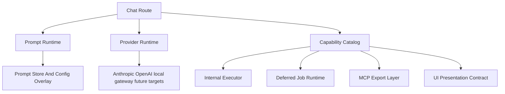

# 03 Target Architecture
> **Historical snapshot.** This document describes the pre-unification system
> state and was used as research input for the sprint program. For current
> architecture, see `02-post-unification-architecture.md` and
> `04-fully-unified-architecture.md`.
This document defines the target architecture for a unified, reliable system.

## 1. Target Outcome

The system should converge on a model where each concern has one authoritative contract:

- capability definition
- provider creation and provider policy
- prompt composition and prompt provenance
- protocol export for MCP
- UI rendering metadata
- deferred execution semantics

## 2. Architectural Principles

### One source of truth per concern

Each architectural concern should have one authoritative definition and many generated or derived consumers.

### Thin protocol boundaries

MCP servers, HTTP routes, and admin actions should wrap domain behavior, not redefine it.

### Derivation over duplication

If a capability needs metadata for runtime, UI, and MCP exposure, those should be derived from one capability definition.

### Strong seam contracts

The system should prefer stable domain services and capability contracts over direct repository writes from many surfaces.

### Auditable prompt assembly

Every generated turn should be traceable to its prompt inputs.

### Centralized provider runtime

Timeouts, retries, model fallback, and provider target selection should live in one runtime.

## 3. Proposed System Shape

## 4. The Capability Catalog

The system needs one catalog that defines each capability once.

Each capability entry should describe:

- canonical name
- family
- role scope
- execution mode
- input schema
- domain executor binding
- prompt-visible description
- UI presentation hints
- deferred execution policy if applicable
- protocol export flags

### Derived outputs from the capability catalog

- app tool registration for chat runtime
- Anthropic-compatible schemas for prompt and tool use
- UI capability presentation descriptors
- deferred-job metadata
- MCP server tool definitions

## 5. The Prompt Runtime

Prompt assembly should move from "builder plus scattered sources" to a formal prompt runtime.

That runtime should:

- load active prompt versions
- apply config overlays intentionally
- incorporate routing, page, summary, referral, and user preference blocks
- include the exact capability manifest for the turn
- produce both final prompt text and a prompt provenance object

### Required outputs

- final prompt string for the provider
- provenance metadata suitable for logs, events, or debug tools

## 6. The Provider Runtime

Provider creation should be centralized into one runtime that all model-backed flows use.

This runtime should own:

- provider target selection
- API client creation
- retry and timeout policy
- model fallback policy
- structured provider error mapping
- observability hooks

### Consumers that should use the same runtime

- streaming chat
- direct turns
- summarization
- blog generation
- future eval runners where practical

## 7. The MCP Export Layer

MCP support should remain, but it should become an export of the capability system rather than a parallel capability definition system.

### Design rule

MCP server files should be transport wrappers that bind exported capabilities to protocol handlers.

### Benefits

- fewer duplicate schemas
- easier protocol parity testing
- clearer server boundary ownership

## 8. The Deferred Job Runtime

Deferred execution should remain a first-class runtime because it is already one of the stronger parts of the system.

However, job capability metadata should be derived from the capability catalog rather than maintained in parallel whenever possible.

## 9. The UI Capability Contract

The UI already benefits from `CapabilityResultEnvelope` and specialized cards. That direction should be preserved.

The target state is:

- capability catalog defines presentation defaults
- result envelope remains the canonical payload for rich rendering
- custom cards stay payload-first
- fallback cards remain safe and visible for degraded states

## 10. Non-Goals

This unification effort should not:

- remove useful typed tool modules
- replace all direct function calls with protocol calls just for purity
- force every subsystem into the exact same lifecycle if that reduces clarity
- break the current UI payload architecture to chase theoretical elegance

The goal is less duplication and stronger contracts, not performative abstraction.