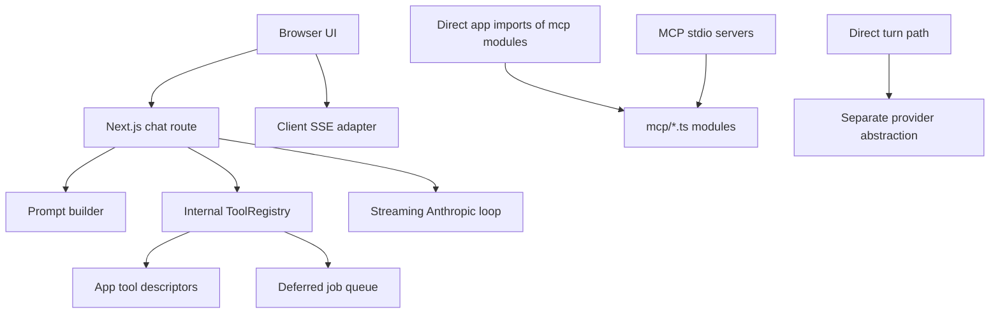
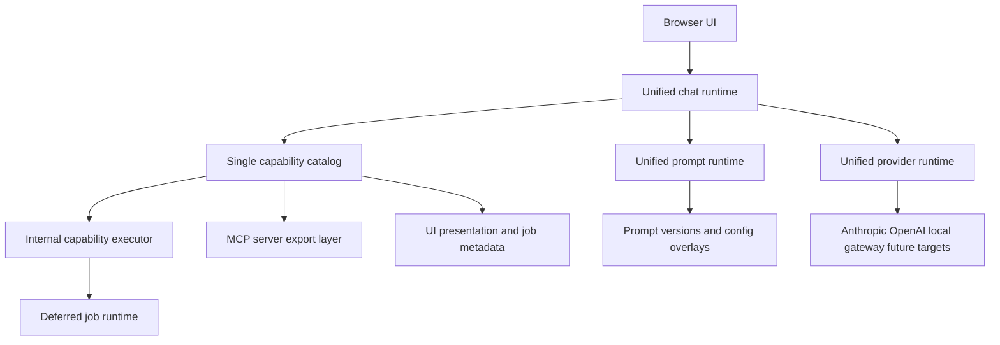

# Unification Research Index

This workstream documents the current architecture of Studio Ordo as it exists today, the drift between overlapping subsystems, and a path toward a more reliable, unified, SOLID, and DRY design.

The goal of this folder is not to restate ideal architecture in the abstract. The goal is to map the actual system boundary as implemented, identify where truth is duplicated, and define a practical convergence plan.

## Scope

This research focuses on the cross-cutting seams that shape reliability the most:

- LLM provider creation and request execution
- chat streaming and direct-turn orchestration
- chat event topology, state synchronization, and stop semantics
- internal tool registry and deferred-job execution
- MCP server boundaries and MCP-shaped module reuse
- prompt ownership, prompt versioning, and prompt assembly
- service lifetime boundaries and control-plane mutation paths
- UI capability rendering contracts
- test and verification coverage at system seams

## Read In This Order

1. [01-current-state-architecture.md](01-current-state-architecture.md)
2. [02-problem-catalog.md](02-problem-catalog.md)
3. [03-target-architecture.md](03-target-architecture.md)
4. [04-capability-unification.md](04-capability-unification.md)
5. [05-provider-and-prompt-unification.md](05-provider-and-prompt-unification.md)
6. [06-test-and-verification-strategy.md](06-test-and-verification-strategy.md)
7. [07-migration-roadmap.md](07-migration-roadmap.md)
8. [08-chat-runtime-event-topology.md](08-chat-runtime-event-topology.md)
9. [09-service-lifetime-and-control-plane-seams.md](09-service-lifetime-and-control-plane-seams.md)
10. [10-current-works-vs-doesnt-work.md](10-current-works-vs-doesnt-work.md)
11. [11-provider-runtime-path-matrix.md](11-provider-runtime-path-matrix.md)
12. [12-prompt-equivalence-and-control-plane-audit.md](12-prompt-equivalence-and-control-plane-audit.md)
13. [13-test-reality-inventory.md](13-test-reality-inventory.md)
14. [14-concrete-runtime-interface-set.md](14-concrete-runtime-interface-set.md)
15. [15-ranked-gap-matrix.md](15-ranked-gap-matrix.md)

## Execution Package

The numbered documents above are the research and target-state set.

The execution package that carries this workstream from current state to ideal
state now lives here:

- [spec.md](spec.md)
- [sprints/README.md](sprints/README.md)
- [artifacts/README.md](artifacts/README.md)

Read those after the ranked gap matrix when you want the full implementation and
release plan rather than only the analysis.

## Executive Summary

The repository currently contains multiple partially overlapping architectural systems:

- an internal chat tool architecture built around `ToolRegistry`
- standalone MCP servers under `mcp/`
- direct in-app imports of MCP-shaped modules
- multiple Anthropic execution paths with different resilience behavior
- multiple prompt ownership paths with different side effects
- multiple capability metadata systems for chat, jobs, and UI rendering

None of those systems are individually unreasonable. The problem is that they are not derived from one source of truth, so architectural drift accumulates in the seams.

The most important conclusion from this research is simple:

1. The app chat runtime is not currently MCP-first.
2. The app is not truly unified around a single capability model.
3. Prompt assembly, prompt administration, and prompt event emission do not currently share one behavioral contract.
4. Provider creation is duplicated enough to make reliability policy and provider swaps harder than necessary.
5. The heaviest mocking occurs exactly where the architecture needs real contract confidence.

## Current And Target Shapes

### Current shape

### Target shape

## Design Principles For This Workstream

1. One source of truth per concern.
2. Runtime-visible behavior must be derived from the same contract that drives prompt-visible behavior.
3. Protocol boundaries should be thin wrappers around domain capabilities, not parallel architectures.
4. Prompt assembly must be inspectable, auditable, and version-aware.
5. Reliability policy belongs in shared infrastructure, not duplicated call sites.
6. Tests should verify system contracts at the seam, not only mocked happy paths.

## Intended Outcome

This folder should give the repo a stable reference for future refactor work so changes can be evaluated against a coherent target architecture instead of local convenience.
