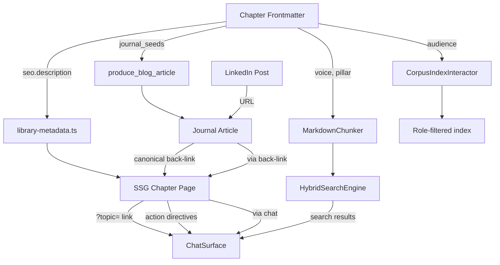

# System Integration Spec: Content × System Architecture

## Purpose

This document maps how the content strategy integrates with the production system. Every design decision in the content strategy has a corresponding system touchpoint. This is the cross-reference table.

---

## System Components and Content Integration

### 1. FileSystemCorpusRepository

**File:** `src/adapters/FileSystemCorpusRepository.ts`
**What it does:** Discovers books from `book.json` manifests, parses chapter markdown, and builds the searchable document index.

**Content integration:**
- Book structure is defined entirely by file layout — `book.json` in each book directory triggers discovery
- Chapter YAML frontmatter parsed for title, audience, and metadata
- Directories starting with `_` are excluded (archive convention)
- SEE spec: `specs/corpus-replacement.md` for the archive + scaffold operation
- SEE spec: `specs/chapter-frontmatter-schema.md` for extended frontmatter

### 2. MarkdownChunker

**File:** `src/core/search/MarkdownChunker.ts`
**What it does:** Splits chapter markdown into heading-aware chunks, preserves atomic blocks (blockquotes, code, tables), and produces search-ready segments.

**Content integration:**
- Voice directives (`[!architect]`, `[!machine]`) live inside blockquotes — already preserved as atomic units
- Chunk metadata should carry voice attribution when a chunk includes a voice directive
- SEE spec: `specs/voice-directive-rendering.md` for chunk metadata extension

### 3. HybridSearchEngine

**File:** `src/core/search/HybridSearchEngine.ts`
**What it does:** Vector + BM25 hybrid search with Reciprocal Rank Fusion.

**Content integration:**
- Chapter frontmatter fields (`pillar`, `voice`, `emotional_beat`) enrich search result metadata
- The chat can say "The Architect discusses this in Chapter 6" when results include voice attribution
- No changes to the fusion algorithm — only metadata enrichment

### 4. MarkdownProse

**File:** `src/components/MarkdownProse.tsx`
**What it does:** Renders markdown with custom blockquote directives (`[!pullquote]`, `[!sidenote]`).

**Content integration:**
- NEW: `[!architect]` and `[!machine]` voice directives
- NEW: `[!action send="..."]` interactive action directives
- SEE specs: `specs/voice-directive-rendering.md`, `specs/action-directive-rendering.md`

### 5. Library Page (`/library/[document]/[section]`)

**File:** `src/app/library/[document]/[section]/page.tsx`
**What it does:** SSG'd chapter page with sidebar, prev/next nav, JSON-LD, and "Ask the AI" link.

**Content integration:**
- SEO metadata from frontmatter instead of content extraction
- OG images per chapter (generated or dynamic)
- The `?topic=` link already bridges to chat — action directives make this granular
- SEE spec: `specs/seo-hardening.md`

### 6. Blog Production Pipeline

**Files:** `blog-production.tool.ts`, `journal-write.tool.ts`, `AnthropicBlogArticlePipelineModel.ts`
**What it does:** AI-powered article composition, QA, revision, hero image generation, and publishing.

**Content integration:**
- Chapter `journal_seeds` frontmatter provides pre-written briefs for the pipeline
- Each seed maps to a content pillar and targets a LinkedIn audience segment
- SEE spec: `specs/journal-content-pillar-seeding.md`

### 7. Journal Pages (`/journal/[slug]`)

**Files:** `PublicJournalPages.tsx`, `JournalLayout.tsx`
**What it does:** Renders published articles with standfirst, hero image, section taxonomy, and archive navigation.

**Content integration:**
- Articles link back to source chapters via canonical back-link
- Journal classification (essay vs. briefing) maps to content pillar sections
- OG metadata with hero images enables LinkedIn large image cards
- SEE spec: `specs/seo-hardening.md`

### 8. ChatSurface

**File:** `src/frameworks/ui/ChatSurface.tsx`
**What it does:** Floating AI chat panel available on every page.

**Content integration:**
- `[!action]` directives in chapters send pre-composed messages to the chat
- The chat has access to `search_corpus` and `get_section` to pull chapter content
- The chat's tool responses include suggestion pills for follow-up actions

### 9. Sitemap & Robots

**Files:** `src/app/sitemap.ts`, `src/app/robots.ts`
**What it does:** Generates sitemap.xml and robots.txt for search engine crawling.

**Content integration:**
- Sitemap auto-discovers new chapters via `getCorpusSummaries()`
- Robots.txt needs `/journal/` added to allow list
- SEE spec: `specs/seo-hardening.md`

### 10. Instance Identity

**File:** `src/lib/config/instance.ts`, `config/identity.json`
**What it does:** Provides instance-level config (name, domain, tagline, logo, analytics, LinkedIn URL).

**Content integration:**
- `identity.linkedInUrl` used in journal article author links
- `identity.domain` used in all canonical URLs and OG tags
- `identity.logoPath` is the fallback OG image — should be replaced by per-page OG images

---

## Content-to-System Flow

---

## What Changes Are Required

| Component | Change Type | Spec |
|---|---|---|
| `MarkdownProse.tsx` | Feature add | `specs/voice-directive-rendering.md` |
| `MarkdownProse.tsx` | Feature add | `specs/action-directive-rendering.md` |
| `MarkdownChunker.ts` | Metadata extension | `specs/voice-directive-rendering.md` |
| `library-metadata.ts` | SEO improvement | `specs/seo-hardening.md` |
| `PublicJournalPages.tsx` | JSON-LD + Twitter cards | `specs/seo-hardening.md` |
| `robots.ts` | Config update | `specs/seo-hardening.md` |
| `FileSystemCorpusRepository.ts` | Frontmatter extension | `specs/chapter-frontmatter-schema.md` |
| `docs/_corpus/` | File operations | `specs/corpus-replacement.md` |
| Blog pipeline | No code changes | `specs/journal-content-pillar-seeding.md` |

---

## What Does NOT Change

- **HybridSearchEngine** — no algorithm changes, only metadata enrichment
- **ChatPresenter** — no changes needed, already handles tool responses
- **SystemPromptBuilder** — no changes needed
- **JobQueueDataMapper** — no changes needed
- **CorpusTools** — search and retrieval tools work unchanged
- **CAPABILITY_CATALOG** — no new capabilities required for this phase
